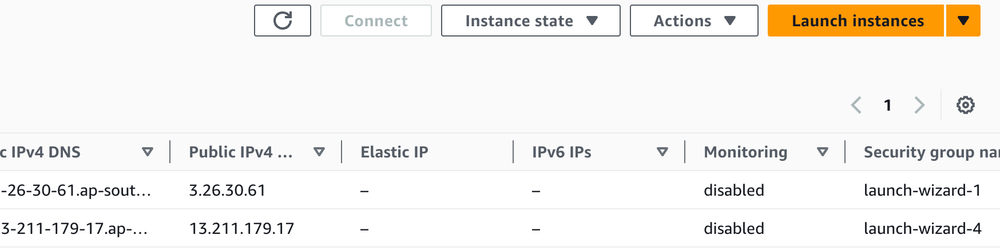
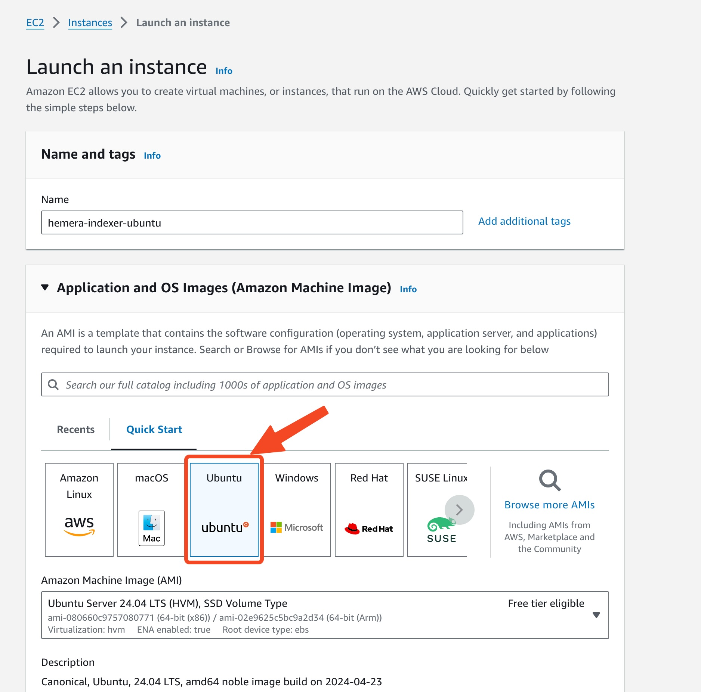

#### Create an AWS EC2 Instance
1. Navigate to EC2 console
   
2. Launch an AWS Instance
  - Select ubuntu as the operating system
    
  - Select ssh key pair for you to log into the VM later
    
  - Change the disk size that fits your need
    
  - [TODO] Expose postgres port
  - Click Launch
3. Once the instance is created, ssh into the instance and follow instructions in [Configure Hemera Indexer](#configure-hemera-indexer) section.
