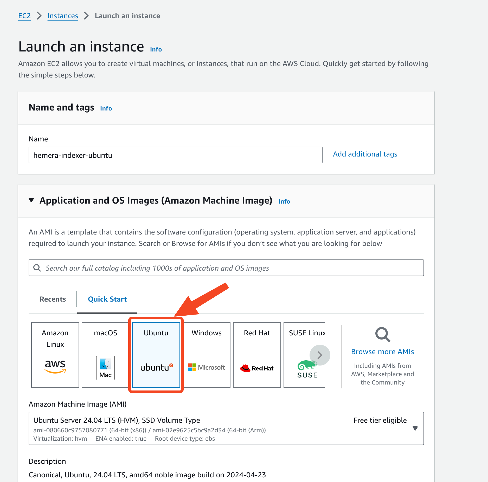

<!-- TOC -->
* [Introduction](#introduction)
* [Prerequisites](#prerequisites)
  * [VM](#vm)
    * [Crete VM From Cloud Services](#crete-vm-from-cloud-services)
      * [Create an AWS EC2 Instance](#create-an-aws-ec2-instance)
      * [Create a Compute Engine on GCP](#create-a-compute-engine-on-gcp)
  * [Install Docker & Docker Compose](#install-docker--docker-compose)
* [Install and Run Hemera Indexer](#install-and-run-hemera-indexer)
  * [Clone the Repository](#clone-the-repository)
  * [Enter the Docker Compose Folder](#enter-the-docker-compose-folder)
* [Configure Hemera Indexer](#configure-hemera-indexer)
  * [Parameters](#parameters)
      * [`PROVIDER_URI`](#provider_uri)
      * [`OUTPUT`](#output)
* [Export Result](#export-result)
  * [Export From Postgresql Database](#export-from-postgresql-database)
  * [Export From Output Files](#export-from-output-files)
<!-- TOC -->

# Introduction

Hemera Indexer reads information from a blockchain and extracts specific data such as blocks, transactions, and specific
types of transactions to a database or CSV/JSON files.

# Prerequisites

- VM
  - Ubuntu
  - Minimal disk size of ? GB
  - CPU?
  - Network access
- RPC Node of your EVM compatible blockchain

## VM

### Crete VM From Cloud Services

If you don't have a VM in place, here is the guidance on how to create one from popular cloud providers.

#### Create an AWS EC2 Instance



#### Create a Compute Engine on GCP

## Install Docker & Docker Compose

If you have trouble running the following commands, consider referring to
the [official docker installation guide](https://docs.docker.com/engine/install/ubuntu/#install-using-the-repository)
for the latest instructions.

```bash
# Add Docker's official GPG key:
sudo apt-get update
sudo apt-get install ca-certificates curl
sudo install -m 0755 -d /etc/apt/keyrings
sudo curl -fsSL https://download.docker.com/linux/ubuntu/gpg -o /etc/apt/keyrings/docker.asc
sudo chmod a+r /etc/apt/keyrings/docker.asc

# Add the repository to Apt sources:
echo \
  "deb [arch=$(dpkg --print-architecture) signed-by=/etc/apt/keyrings/docker.asc] https://download.docker.com/linux/ubuntu \
  $(. /etc/os-release && echo "$VERSION_CODENAME") stable" | \
  sudo tee /etc/apt/sources.list.d/docker.list > /dev/null
sudo apt-get update
```

```bash
# Install docker and docker compose
sudo apt-get install docker-ce docker-ce-cli containerd.io docker-buildx-plugin docker-compose-plugin
```

# Install and Run Hemera Indexer

## Clone the Repository

```bash
git clone git@github.com:socialscan-io/hemera_indexer.git
```

## Enter the Docker Compose Folder

```bash
cd hemera_indexer
cd docker-compose
```

Alternatively, you might want to edit environment variables in `docker-compose.yaml`. Please check
out [configuration manual](#configure-hemera-indexer) on how to configure the environment variables.

```bash
vim docker-compose.yaml
```

Now, run the following command to spin up the containers.

```bash
sudo docker compose up
```

# Configure Hemera Indexer

## Parameters

#### `PROVIDER_URI`

The provider

#### `OUTPUT`

Output

# Export Result

## Export From Postgresql Database

## Export From Output Files


